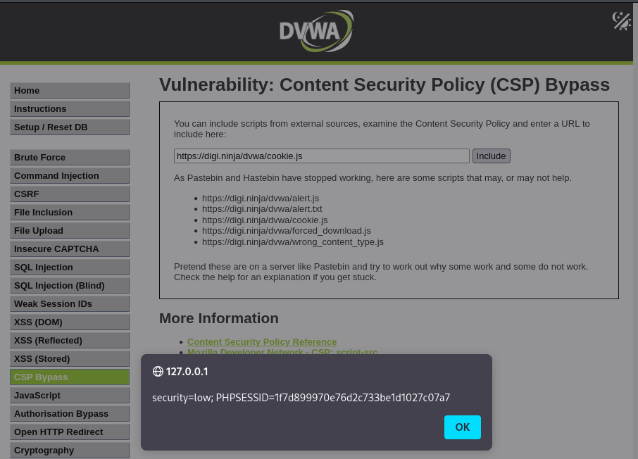
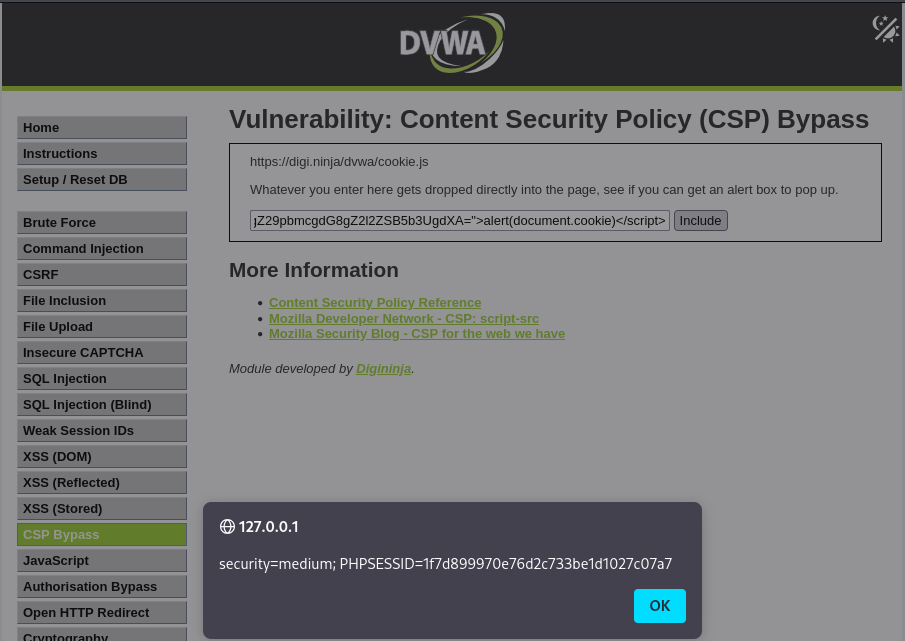

# CSP Bypass - DVWA

## Nivel de seguridad: Low

En este nivel, la política de seguridad de contenido (**CSP: Content Security Policy**) permite la inclusión de scripts externos directamente en la página a través de una URL.



Inicialmente, en muchas guías se utilizaba **Pastebin** para subir código JavaScript personalizado y cargarlo desde allí. Sin embargo, este servicio ha dejado de funcionar correctamente en ese contexto, por lo que DVWA ofrece una serie de scripts de prueba alojados en:

```
https://digi.ninja/dvwa/
```

Entre ellos:
- `alert.js`
- `cookie.js`
- `forced_download.js`

### Payload utilizado
```url
https://digi.ninja/dvwa/cookie.js
```

Este script externo contiene un `alert(document.cookie)` y al ser cargado desde un origen permitido por la CSP, se ejecuta con éxito.

> **Nota:** En este nivel, no hay ningún filtro específico o `nonce`, por lo que cualquier script remoto desde un dominio autorizado se ejecuta.

---

## Nivel de seguridad: Medium

En este nivel, la política CSP utiliza un **nonce (número único de un solo uso)** para permitir la ejecución de scripts. En teoría, esto debería impedir que el atacante ejecute scripts arbitrarios, ya que cada script debe incluir el atributo `nonce` con el valor correcto.



Sin embargo, DVWA utiliza un nonce estático que **no cambia entre peticiones**, por lo que puede ser reutilizado fácilmente.

### Payload utilizado
```html
<script nonce="TmV2ZXIgZ29pbmcgdG8gZ2l2ZSB5b3UgdXA=">alert(document.cookie)</script>
```

Este script es aceptado por la CSP y se ejecuta sin problemas, mostrando las cookies del navegador.

> **Curiosidad:** El valor del nonce es una cadena en **Base64** que decodifica como:
>
> `Never going to give you up`

---

## Comentario adicional

En DVWA, esta sección tiene como objetivo mostrar las debilidades en implementaciones incorrectas o incompletas de CSP. Aunque CSP es una herramienta poderosa para prevenir XSS, su eficacia depende de:
- No permitir `unsafe-inline`.
- No reutilizar valores de `nonce`.
- Limitar los orígenes confiables con precisión.

> **Importante:** La configuración de CSP en estos ejercicios está diseñada intencionadamente para ser vulnerable y mostrar ejemplos comunes de malas prácticas.
