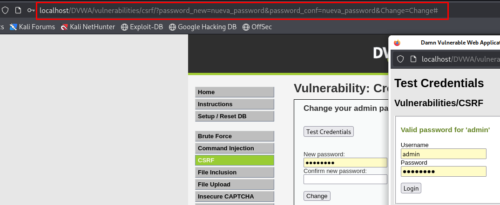

# CSRF - DVWA

## Descripción

La vulnerabilidad encontrada es un **Cross-Site Request Forgery (CSRF)**.

Aunque los métodos indicados en la guía no funcionaban correctamente, pudimos explotar la vulnerabilidad manipulando directamente los parámetros de la URL.



## Explotación

Modificando la URL de la siguiente manera, pudimos cambiar la contraseña del usuario `admin`:

```url
http://localhost/DVWA/vulnerabilities/csrf/?password_new=nueva_password&password_conf=nueva_password&Change=Change#
```

Esto actualiza la contraseña en el servidor sin necesidad de autenticación adicional o protecciones CSRF adecuadas.

Posteriormente, usando las nuevas credenciales, se puede iniciar sesión correctamente.

## Resultados por nivel de seguridad

Esta explotación funciona en todos los niveles de seguridad de DVWA:

- **Low**
- **Medium**
- **High**

---

> **Nota:** La vulnerabilidad CSRF es especialmente peligrosa ya que permite a un atacante realizar acciones en nombre de un usuario válido sin su conocimiento.
