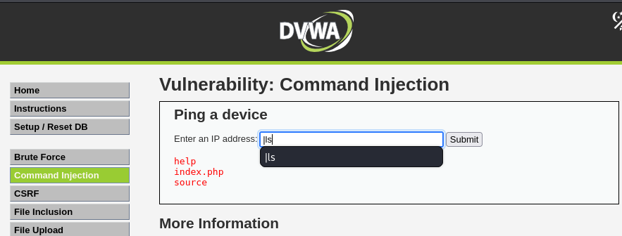

# Command Injection - DVWA

## Descripción

Esta vulnerabilidad consiste en una **inyección de comandos**, donde el backend está agregando nuestro input al comando `ping` de forma insegura.

Aprovechamos esta debilidad para ejecutar comandos arbitrarios en el servidor.



## Payload utilizado

Creamos un payload simple utilizando el operador de pipe `|`:

```bash
|ls
```

Este payload permite que, después del comando `ping`, el servidor ejecute un `ls` para listar los archivos del directorio actual.

## Resultados por nivel de seguridad

El mismo payload `|ls` funciona en todos los niveles de seguridad de DVWA:

- **Low**
- **Medium**
- **High**

---

> **Nota:** El uso del operador `|` es una técnica clásica para la inyección de comandos, permitiendo encadenar órdenes a un comando principal vulnerable.
