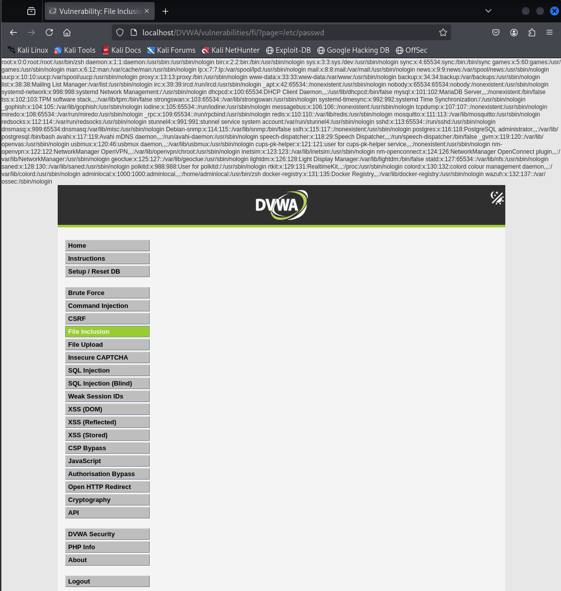

# File Inclusion - DVWA

## Nivel de seguridad: Low

En este caso, la vulnerabilidad se debe a que en la URL hay un parámetro **GET** llamado `page` que es usado para incluir archivos en el servidor.



### Análisis

URL vulnerable:
```url
http://127.0.0.1/vulnerabilities/fi/?page=include.php
```

Cambiando la ubicación del archivo que se incluye, podemos leer ficheros sensibles en el servidor, como `/etc/passwd`:

```url
http://127.0.0.1/vulnerabilities/fi/?page=/etc/passwd
```

### Resultado

Se consigue visualizar el contenido de `/etc/passwd`, confirmando la vulnerabilidad.

## Nivel de seguridad: Medium

La misma vulnerabilidad persiste en el nivel **Medium**, funcionando de la misma manera.

---

> **Nota:** Esta vulnerabilidad es conocida como **Local File Inclusion (LFI)** y puede ser usada para leer archivos críticos del sistema o incluso ejecutar código malicioso si se combina con otras técnicas.
