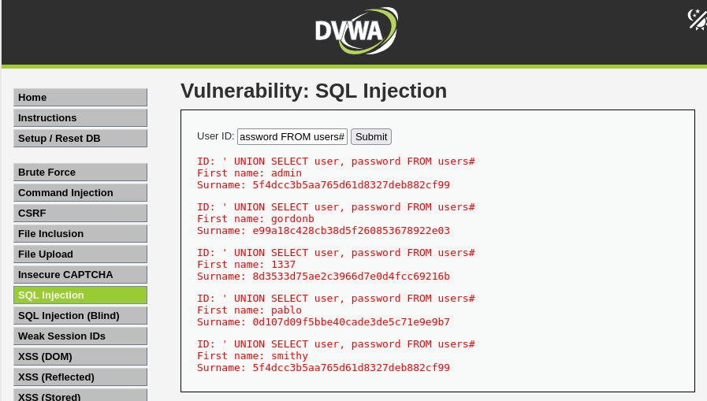
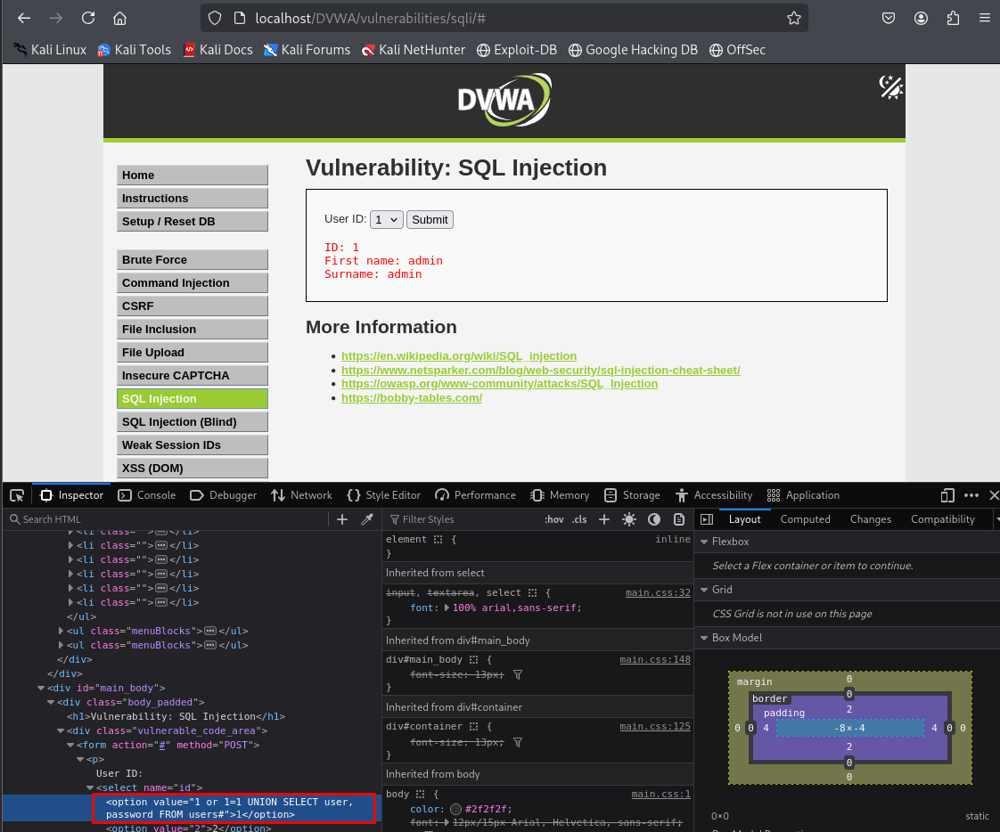
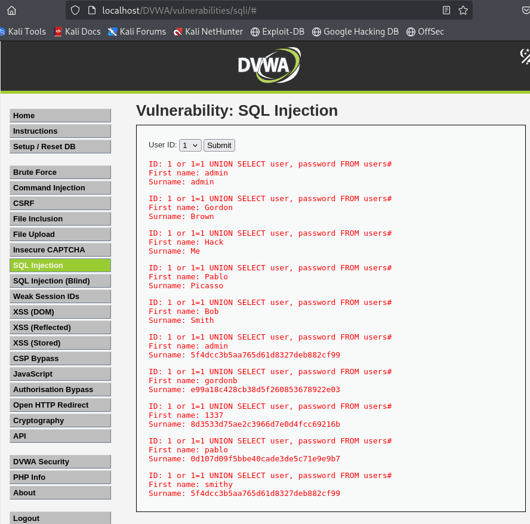

# SQL Injection - DVWA

## Nivel de seguridad: Low

Podemos detectar la vulnerabilidad de **inyección SQL** ingresando un `'` en el campo de entrada. Al hacerlo, se genera un error de SQL, indicando que la entrada no está siendo manejada de forma segura.



### Explotación

Para ver todas las entradas de la base de datos:
```sql
' or 1=1#
```

Para extraer todos los usuarios y contraseñas:
```sql
' UNION SELECT user, password FROM users#
```

Esto permite listar los usuarios y sus hashes de contraseña.

---

## Nivel de seguridad: Medium

En el nivel **Medium**, el formulario usa el método **POST** y además se filtran las comillas simples (`'`). Sin embargo, el valor del campo **ID** se inserta directamente en la consulta SQL, por lo que no necesitamos comillas para explotar la vulnerabilidad.



### Explotación

Payload utilizado:
```sql
1 or 1=1 UNION SELECT user, password FROM users#
```



Esto nos permite visualizar nuevamente todos los usuarios y sus contraseñas.

---

> **Nota:** Aunque se implementaron algunas medidas de seguridad en el nivel Medium, no son suficientes debido a la inyección directa de los parámetros en la consulta SQL.