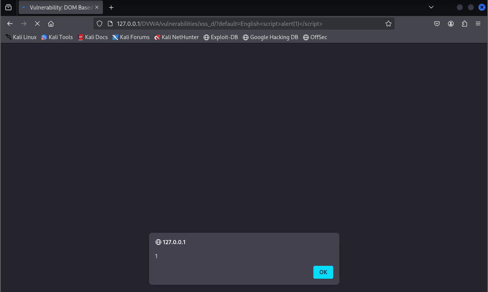
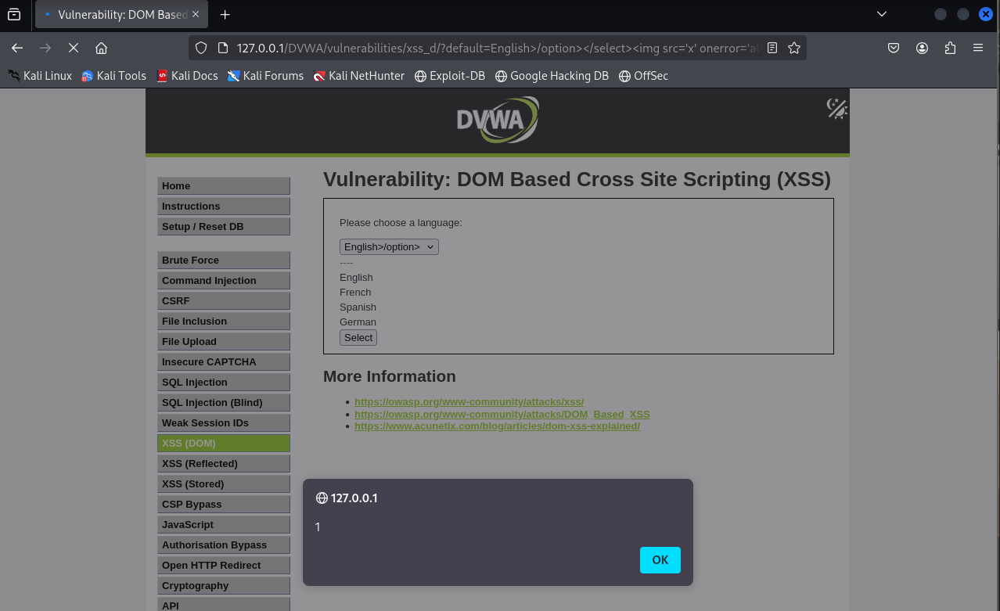

# XSS DOM - DVWA

## Nivel de seguridad: Low

En este nivel, se puede observar que existe un selector de idioma en la página y el valor del parámetro **default** es reflejado directamente en el código sin la debida sanitización.

- URL vulnerable:

```url
http://127.0.0.1/DVWA/vulnerabilities/xss_d/?default=English
```



### Payload utilizado

```html
<script>alert(document.cookie);</script>
```

Al insertar este payload en el parámetro **default**, conseguimos que se ejecute un `alert` mostrando las cookies del navegador.

Esto demuestra que la manipulación del DOM está siendo realizada de forma insegura.

---

## Nivel de seguridad: Medium

En el nivel **Medium**, la vulnerabilidad sigue presente, pero el código de la página hace que estemos atrapados dentro de una etiqueta `<option>`. Además, las etiquetas `<script>` son bloqueadas.

- URL vulnerable:

```url
http://127.0.0.1/DVWA/vulnerabilities/xss_d/?default=English
```



### Payload utilizado

Para evadir las restricciones:

```html
"></option></select>
```

Este payload cierra correctamente las etiquetas abiertas (`</option></select>`) y luego inserta una imagen maliciosa que lanza el `alert` de las cookies mediante el atributo `onerror`.

### Explicación
- Cerramos las etiquetas abiertas de forma controlada.
- Utilizamos un `img` con `src=x` (imagen inexistente) que dispara un error.
- Capturamos ese error con `onerror` y ejecutamos nuestro `alert`.

---

> **Nota:** El XSS basado en DOM ocurre cuando la página cliente manipula el contenido del DOM de forma insegura utilizando datos controlables por el usuario, sin ninguna validación ni escape.
