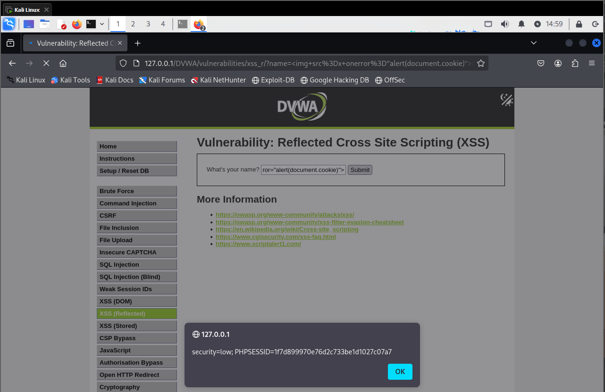
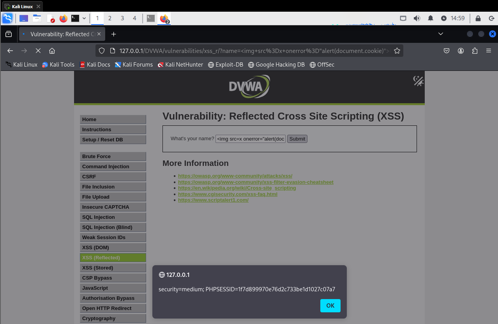
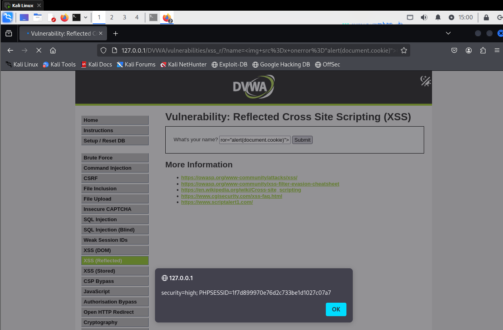

# XSS Reflected - DVWA

## Nivel de seguridad: Low

En este nivel se presenta un campo de texto llamado `name` que refleja el contenido introducido directamente en la página web sin ningún tipo de sanitización o filtrado.

- Esto permite insertar código HTML/JS malicioso directamente desde la URL.



### Payload utilizado
```html

```

Este código provoca un error de carga en la imagen y desencadena un `alert` con el valor de las cookies.

---

## Nivel de seguridad: Medium

En el nivel **Medium**, el comportamiento es exactamente el mismo que en **Low**. A pesar de haber incrementado el nivel de seguridad, el payload sigue funcionando sin ningún cambio.



### Payload utilizado
```html

```

Esto indica que **no hay una validación efectiva** del input, incluso en configuraciones supuestamente más seguras.

---

## Nivel de seguridad: High

Incluso en el nivel **High**, el mismo payload de inyección sigue funcionando sin problemas. Esto confirma que la aplicación vulnerable **no está implementando ninguna defensa efectiva contra XSS reflejado**.



### Payload utilizado
```html

```

---

> **Nota:** El XSS reflejado ocurre cuando los datos enviados por el usuario se devuelven inmediatamente en la respuesta HTTP sin una sanitización adecuada, permitiendo ejecutar scripts maliciosos directa