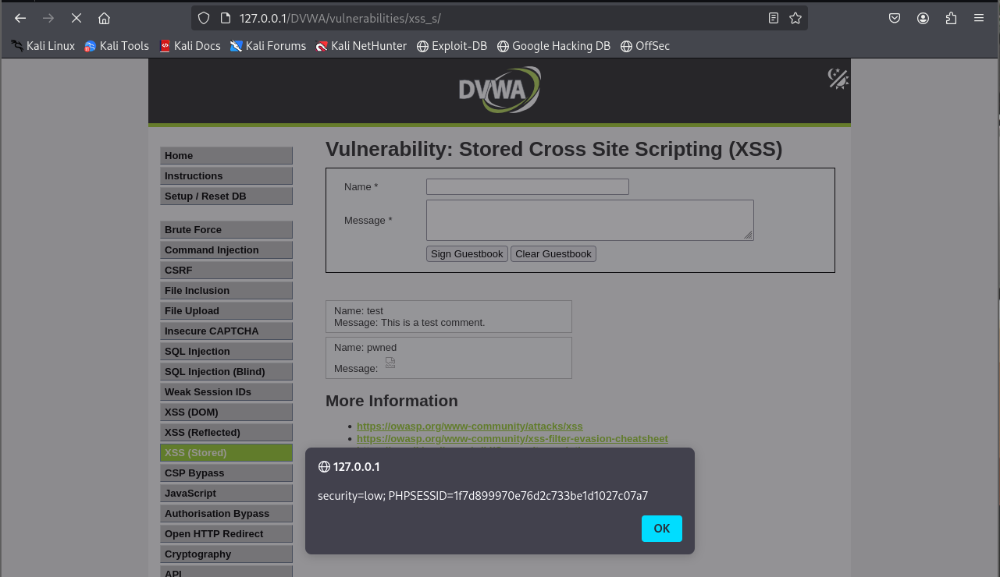
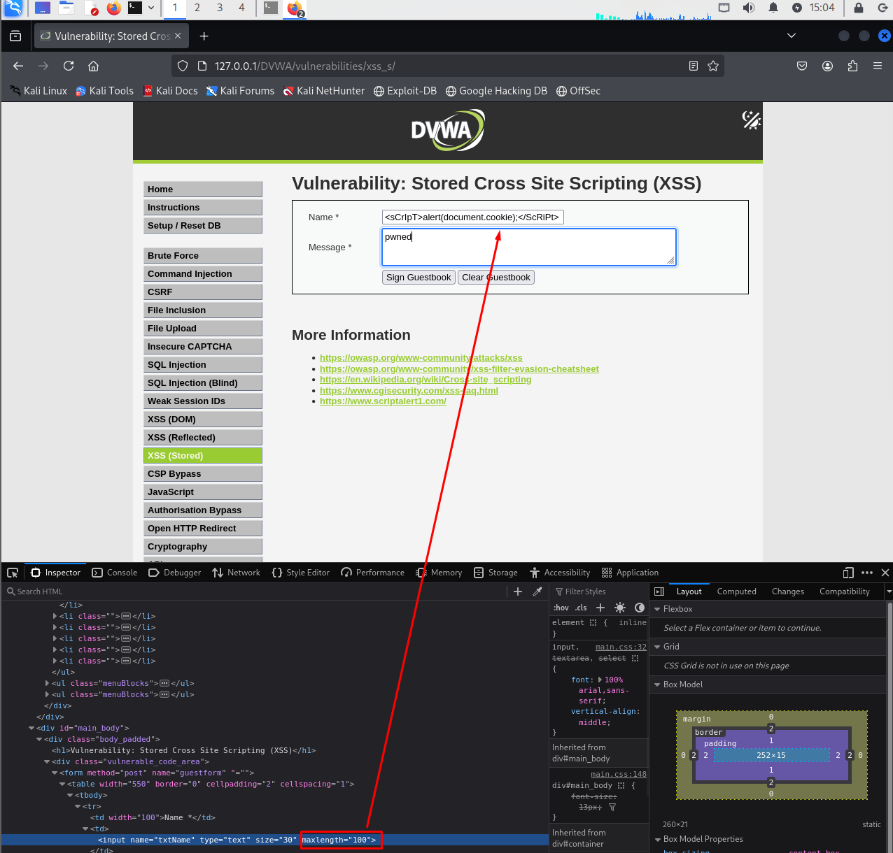
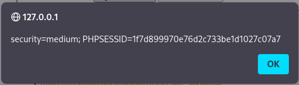
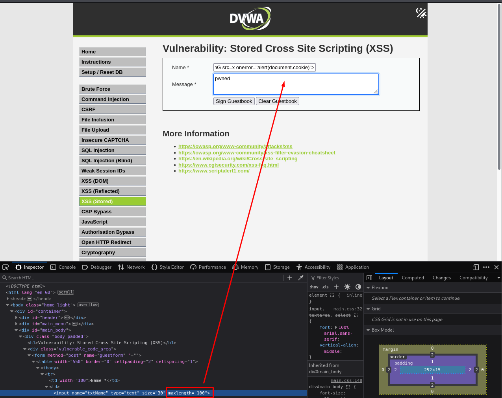
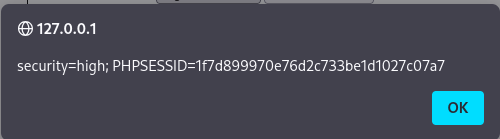

# XSS Stored - DVWA

## Nivel de seguridad: Low

La aplicación cuenta con un formulario con los campos `Name` y `Message` que permiten almacenar comentarios en un libro de visitas.

- Introducimos el siguiente payload en el campo **Message**:

```html

```

- Este código se almacena y se ejecuta cada vez que alguien accede a la página, provocando un `alert` con el valor de las cookies.



---

## Nivel de seguridad: Medium

En este nivel se introduce una limitación de longitud en el campo `Name`, pero se puede **eludir** modificando el atributo `maxlength` desde las DevTools del navegador.

- Insertamos el payload en el campo **Name**:

```html
<sCrIpT>alert(document.cookie);</ScRiPt>
```

- Cambiar el atributo `maxlength="30"` a un valor mayor o quitarlo permite enviar el código completo.




---

## Nivel de seguridad: High

En este nivel la etiqueta `<script>` está completamente bloqueada, por lo que usamos una técnica alternativa.

- Insertamos el siguiente payload en el campo **Name**:

```html

```

- Al igual que en el nivel medio, es necesario editar el atributo `maxlength` en DevTools para poder insertar el código completo.




---

> **Nota:** El XSS almacenado es especialmente peligroso ya que el código malicioso se **guarda en el servidor** y se ejecuta cada vez que un usuario visita la página afectada. Esto puede comprometer la información de múltiples usuarios sin que interactúen directamente con el atacante.
